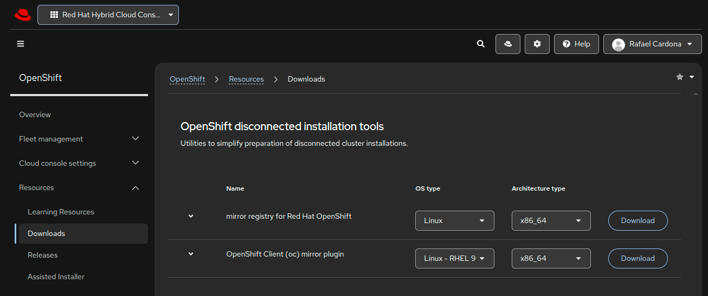

# Sneakernet Mirroring

Red Hat specifically designed the oc-mirror tool to handle this exact scenario using a "mirror-to-disk" workflow. Instead of syncing images over a network to a registry, you pack the OpenShift release, operators, and required images into a massive archive file directly onto an intermediary storage device (like a high-capacity USB drive or external hard disk).Here is how that physical transfer workflow operates in practice:

### ⚠️ Prerequisites & Storage Warning

Before beginning the sneakernet process, ensure your intermediary media (USB drive, external HDD) has sufficient storage capacity. While a base OpenShift release may only take a few gigabytes, adding operators (like OpenShift Data Foundation, OpenShift Virtualization, or Pipelines) can quickly inflate the archive size. **It is recommend a drive with at least 100GB to 250GB of free space** depending on how many operators you mirror.

### 0. Installating binaries and dependencies

- Install depencides
  ```bash
  sudo dnf install -y \
    container-tools \
    openssl \
    jq \
    curl \
    wget \
    tar \
    gzip \
    bind-utils

  podman --version
  skopeo --version
  openssl version
  ```

- Download the binaries; _oc, oc-mirror, openshift-install and mirror-registry_ [__HERE__](https://console.redhat.com/openshift/downloads) 

  

- Installing oc binary
  ```bash    
  tar xvzf openshift-client-linux.tar.gz
  sudo mv oc /usr/local/bin/oc
  sudo chmod +x /usr/local/bin/oc
  ```

- Install the `oc-mirror` plugin:
  ```bash
  tar xvzf oc-mirror.tar.gz
  sudo install -m 0755 oc-mirror /usr/local/bin/oc-mirror
  umask 0022
  ```

- Verify the tool
  ```bash
  oc version --client
  oc mirror --v2 --help
  openshift-install version
  ```

### 1. Preparing the images

#### Red Hat Openshift Base Images and Operators

You will also need an `imageset-config.yaml` file to define exactly what you want to mirror. If you don't have one yet, here is a basic example to get you started:

  ```yaml
  # example-imageset-config.yaml
  apiVersion: mirror.openshift.io/v2alpha1
  kind: ImageSetConfiguration

  mirror:

    platform:
      architectures:
        - amd64
      channels:
        - name: stable-4.21
          type: ocp
          minVersion: "4.21.26"
          maxVersion: "4.21.26"
      graph: false

    operators:
      - catalog: registry.redhat.io/redhat/redhat-operator-index:v4.21
        packages:

          - name: kubevirt-hyperconverged
            channels:
              - name: stable

          - name: numaresources-operator
            channels:
              - name: "4.21"

          - name: metallb-operator
            channels:
              - name: stable

          - name: kernel-module-management
            channels:
              - name: stable

          - name: kubernetes-nmstate-operator
            channels:
              - name: stable
  ```

#### IBM Fusion Access for SAN

IBM Fusion 2.13 introduces Fusion Access for SAN as a Fusion Data Foundation 4.21 capability. IBM's current disconnected procedure for OCP 4.21+ says the disconnected environment needs three IBM-related sets of content [DOCS](https://www.ibm.com/docs/en/fusion-software/2.13.0?topic=images-mirroring-fusion-data-foundation):

  - Red Hat Operators
  - Fusion Data Foundation 4.21
  - IBM Storage Scale 6.0.1.0 images

IBM's current oc-mirror v2 configuration for Fusion Data Foundation 4.21 uses

  ```yaml
  - catalog: icr.io/cpopen/isf-data-foundation-catalog:v4.21
  ```

and IBM explicitly lists the required packages as:

  ```yaml
    operators:

      - catalog: icr.io/cpopen/isf-data-foundation-catalog:v4.21
        packages:

          - name: cephcsi-operator
          - name: mcg-operator
          - name: ocs-operator
          - name: odf-csi-addons-operator
          - name: odf-multicluster-orchestrator
          - name: odf-operator
          - name: odr-cluster-operator
          - name: odr-hub-operator
          - name: ocs-client-operator
          - name: odf-prometheus-operator
          - name: recipe
          - name: rook-ceph-operator
          - name: odf-dependencies
          - name: odf-external-snapshotter-operator
          - name: ibm-spectrum-scale-operator
          - name: cnsa-dependencies
  ```

---

#### Complete ImageSetConfiguration for this installation

  ```bash
  cat imageset-config.yaml
  ```

  ``` yaml
  apiVersion: mirror.openshift.io/v2alpha1
  kind: ImageSetConfiguration

  mirror:

    # =========================================================
    # OpenShift Container Platform 4.21.26
    # =========================================================
    platform:
      architectures:
        - amd64

      channels:
        - name: stable-4.21
          type: ocp
          minVersion: "4.21.26"
          maxVersion: "4.21.26"

      # Update graph is not required for the initial installation.
      graph: false


    # =========================================================
    # Operator catalogs
    # =========================================================
    operators:

      # ---------------------------------------------------------
      # Red Hat Operators
      # ---------------------------------------------------------
      - catalog: registry.redhat.io/redhat/redhat-operator-index:v4.21
        packages:

          # OpenShift Virtualization
          - name: kubevirt-hyperconverged

          # NUMA-aware scheduling
          - name: numaresources-operator

          # Required by IBM Fusion Access for SAN / Storage Scale
          - name: kernel-module-management

          # Node networking: bridges, bonds, VLANs, etc.
          - name: kubernetes-nmstate-operator

          # Required by IBM Fusion Data Foundation
          - name: local-storage-operator

          # Required by IBM Fusion Data Foundation
          - name: lvms-operator


      # ---------------------------------------------------------
      # IBM Fusion Software 2.13 base
      # ---------------------------------------------------------
      - catalog: icr.io/cpopen/isf-operator-software-catalog@sha256:569b3f5158af370abe3dbe049c53be55d32f239a717ca74f1f5e544c697e8f21
        packages:
          - name: isf-operator
            channels:
              - name: v2.0
                minVersion: "2.13.0"
                maxVersion: "2.13.0"


      # ---------------------------------------------------------
      # IBM Fusion Usage Metering Service
      # Required component of IBM Fusion
      # ---------------------------------------------------------
      - catalog: icr.io/cpopen/ibm-usage-metering-operator-catalog@sha256:a97cef95c73ac6dacea010818757b4ed9b7440f4c0ec4154a091f248c68d1c9e
        full: true
        packages:
          - name: ibm-usage-metering-operator
            channels:
              - name: v1.0


      # ---------------------------------------------------------
      # IBM Fusion Data Foundation 4.21
      #
      # Fusion Access for SAN is integrated with FDF on OCP 4.21.
      # ---------------------------------------------------------
      - catalog: icr.io/cpopen/isf-data-foundation-catalog:v4.21
        packages:

          - name: cephcsi-operator

          - name: mcg-operator

          - name: ocs-operator

          - name: odf-csi-addons-operator

          - name: odf-multicluster-orchestrator

          - name: odf-operator

          - name: odr-cluster-operator

          - name: odr-hub-operator

          - name: ocs-client-operator

          - name: odf-prometheus-operator

          - name: recipe

          - name: rook-ceph-operator

          - name: odf-dependencies

          - name: odf-external-snapshotter-operator

          # IBM Storage Scale / CNSA integration
          - name: ibm-spectrum-scale-operator

          - name: cnsa-dependencies


    # =========================================================
    # Additional images
    # =========================================================
    additionalImages:

      # ---------------------------------------------------------
      # IBM Fusion Software 2.13 catalog
      # ---------------------------------------------------------
      - name: icr.io/cpopen/isf-operator-software-catalog:2.13.0-13849@sha256:569b3f5158af370abe3dbe049c53be55d32f239a717ca74f1f5e544c697e8f21


      # ---------------------------------------------------------
      # IBM Fusion Usage Metering catalog
      # ---------------------------------------------------------
      - name: icr.io/cpopen/ibm-usage-metering-operator-catalog:2.13.0-24525@sha256:a97cef95c73ac6dacea010818757b4ed9b7440f4c0ec4154a091f248c68d1c9e


      # =========================================================
      # IBM Storage Scale 6.0.1.0
      #
      # Required for IBM Fusion Access for SAN on OCP 4.21.
      # These are pinned to the image digests published by IBM
      # for Storage Scale 6.0.1.0.
      # =========================================================

      # CSI sidecars
      - name: cp.icr.io/cp/gpfs/csi/csi-attacher:v4.11.0@sha256:b74b05b39501565022883fc128002b4cb857a7bb6c858606bcb3fdedba0b0b80

      - name: cp.icr.io/cp/gpfs/csi/csi-node-driver-registrar:v2.16.0@sha256:ab482308a4921e28a6df09a16ab99a457e9af9641ff44fb1be1a690d07ce8b70

      - name: cp.icr.io/cp/gpfs/csi/csi-provisioner:v6.2.0@sha256:6be9f63ca4caa6c46aae55aa372500949d8a21473d72f819da1f746076b32d4e

      - name: cp.icr.io/cp/gpfs/csi/csi-resizer:v2.1.0@sha256:589e525cddef6d768e68da1f0bc9ffd0a24bf3add3dd010648eb7189976fde79

      - name: cp.icr.io/cp/gpfs/csi/csi-snapshotter:v8.5.0@sha256:da081c27e8a6d91f36042c1942362d0515ced8d06e18c11b8f893e58c4d6d797

      - name: cp.icr.io/cp/gpfs/csi/ibm-spectrum-scale-csi-driver:v3.1.0@sha256:35c2c45c0a8f6504cf50dda57fd0c827244e822e02febf449a37630fc6d01b9d

      - name: cp.icr.io/cp/gpfs/csi/livenessprobe:v2.18.0@sha256:c4cc074199c045dd73ab85f28897e2a32f4d6f38ffdba4f3b13b8007ccbd3570


      # IBM Storage Scale
      - name: cp.icr.io/cp/gpfs/data-management/ibm-spectrum-scale-daemon:v6.0.1.0@sha256:3651a79cfd42e67416995af3442b667beef09c9c1417e406b7be20cb63497ddf

      - name: cp.icr.io/cp/gpfs/ibm-spectrum-scale-core-init:v6.0.1.0@sha256:1775f4d2c51ae9bef6d0d129c79efcfefb4d6d4008445d57b852d4c4397b2fe2

      - name: cp.icr.io/cp/gpfs/ibm-spectrum-scale-coredns:v6.0.1.0@sha256:781db6ee6019ae2468b57f48abc17033ccfcdb88beb555b2797ee4fe32a2731b

      - name: cp.icr.io/cp/gpfs/ibm-spectrum-scale-grafana-bridge:v6.0.1.0@sha256:3843a5db15d214355d7c80751b7ab771cbaef9be025eea04745386d9210914e5

      - name: cp.icr.io/cp/gpfs/ibm-spectrum-scale-gui:v6.0.1.0@sha256:fd85ae58cfdf4ef48b300f542967a0b2e626ff4015af86a5f31e648b76d11160

      - name: cp.icr.io/cp/gpfs/ibm-spectrum-scale-logs:v6.0.1.0@sha256:16754a6b3e1eaac73a3df6d6ded01d31e0f5d0cc75dc6f30d1cb8043d2dc0685

      - name: cp.icr.io/cp/gpfs/ibm-spectrum-scale-monitor:v6.0.1.0@sha256:a15797ec26b5e6b54de4396ed4fdb9303169908c04337694ff2d2f2e9372df87

      - name: cp.icr.io/cp/gpfs/ibm-spectrum-scale-pmcollector:v6.0.1.0@sha256:10dd10e7ab9c32d36b31924c266671573c48fe1fd4c43cb1a6d89d7644482a4c

      - name: cp.icr.io/cp/gpfs/postgres:18.1-alpine3.23@sha256:aa6eb304ddb6dd26df23d05db4e5cb05af8951cda3e0dc57731b771e0ef4ab29


      # IBM Storage Scale operator components
      - name: icr.io/cpopen/ibm-spectrum-scale-must-gather:v6.0.1.0@sha256:39d5a03dcc657ce704299767e09408e52be040edf11d8a2cf4b72864178e4535

      - name: icr.io/cpopen/ibm-spectrum-scale-operator-bundle:v6.0.1.0@sha256:b29e753b855f26561dc320c90f70940d96400d79d04f6870a8aef3ca72b6e5f0

      - name: icr.io/cpopen/ibm-spectrum-scale-operator:v6.0.1.0@sha256:5e2095f878f45b561e17fc00725d6ca69653d12f7693d295b0a53a40046f1a45
  ```

 ⚡️ Important: the cp.icr.io credentials must contain the customer's IBM Fusion entitlement. IBM explicitly requires that entitlement for these images [DOCS](https://www.ibm.com/docs/en/fusion-software/2.13.0?topic=images-mirroring-fusion)


#### IBM Connected Side

IBM requires the username to be literally cp, with the customer's IBM entitlement key as the password; the entitlement must include IBM Fusion.

- Authenticate to the IBM Entitled Container Registry

IBM Fusion Access for SAN and IBM Storage Scale use entitled container images hosted in:

  ```text
  cp.icr.io
  ``` 

require authentication with an IBM entitlement key.

The IBM public Operator images hosted under:

  ```text
  icr.io/cpopen/..
  ```

- Obtain the IBM entitlement key

Obtain an entitlement key from the IBM Container Software Library using an IBMid associated with the customer's IBM Fusion entitlement.

The entitlement key must provide access to the IBM Fusion / IBM Storage Scale images required by this deployment.

The credentials used for cp.icr.io are:
  ```text
  Registry:  cp.icr.io
  Username:  cp
  Password:  <IBM entitlement key>
```

⚡️ NOTE: The username is always cp. The entitlement key is used as the password.

- Create a persistent authentication file

For oc-mirror, use an explicit authentication file rather than relying only on the default Podman runtime authentication file.

- Create a protected directory:
  ```bash
  mkdir -p "${HOME}/.config/oc-mirror"
  chmod 700 "${HOME}/.config/oc-mirror"
  ```

export MIRROR_AUTH_FILE="${HOME}/.config/oc-mirror/auth.json"

- Authenticate to the IBM Entitled Container Registry:
  ```bash
  podman login \
    --authfile "${MIRROR_AUTH_FILE}" \
    --username cp \
    cp.icr.io
  ```

- Enter the IBM entitlement key when prompted:
  ```bash
  Password: <IBM entitlement key>
  Login Succeeded!
  ```

Using the password prompt avoids placing the entitlement key directly in the shell command history.

- Add the Red Hat credentials to the same authentication file

The same authentication file can contain credentials for all source registries required by oc-mirror.

Authenticate to the Red Hat registry:
  ```bash
  podman login \
    --authfile "${MIRROR_AUTH_FILE}" \
    registry.redhat.io
  ```

Enter the Red Hat registry username and password when prompted.

The authentication file should now contain entries for at least:
  ```text
  cp.icr.io
  registry.redhat.io
  ```

quay.io and icr.io/cpopen normally contain publicly accessible content and do not require IBM entitlement credentials.

Verify the configured registry entries without displaying the credentials:
  ```bash
  jq -r '.auths | keys[]' "${MIRROR_AUTH_FILE}"
  ```

  Example:
  ```text
  cp.icr.io
  registry.redhat.io
  ```
  
#### Verify IBM entitlement access
 

Authentication to cp.icr.io does not necessarily prove that the IBMid has the correct product entitlement.

Verify access against one of the entitled IBM Storage Scale images defined in imageset-config.yaml.

For example:
  ```bash
  skopeo inspect \
    --authfile "${MIRROR_AUTH_FILE}" \
    docker://cp.icr.io/cp/gpfs/<image>@sha256:<digest> \
    > /dev/null
  ```

A successful command confirms that the entitlement key can access that image.

If the command returns an authentication or authorization error, verify that:

  - the entitlement key is valid
  - the IBMid associated with the key has IBM Fusion entitlement
  - access to cp.icr.io is permitted through the firewall/proxy
  - the requested IBM Storage Scale image is included in the customer's entitlement


----

### 2. Mirror to Disk (media, directory on OS, etc)

Requires internet access.On a machine connected to the internet, you run **oc-mirror** targeting a local directory on your portable media (e.g., a mounted USB drive) instead of a registry URL.

  ```bash
  # Note the file:// protocol instead of docker://
  mkdir -p "${HOME}/oc-mirror-workspace"
  mkdir -p "${HOME}/oc-mirror-cache"

  oc mirror --v2 \
    --config imageset-config.yaml \
    --authfile "${MIRROR_AUTH_FILE}" \
    --workspace "${HOME}/oc-mirror-workspace" \
    --cache-dir "${HOME}/oc-mirror-cache" \
    file:///mnt/usb-drive/mirror-archive
  ```

💥 This downloads and packages all requested container images, along with the metadata, into a .tar archive on the drive.


### 3. The Physical Air-Gap Transfer:The Sneakernet (in case of removable media)

One safely unmount the USB drive, physically walk it across the facility, often passing it through security scanners or malware kiosks as required by the organization, and plug it into a Bastion host sitting entirely inside the restricted network.

### 4. Mirror to Registry (Disconnected Environment)

No internet access, from the internal Bastion host, oc-mirror is run again. This time, it is instructed it to unpack the archive from the USB drive and push the images into your internal, disconnected container registry.


  ```bash
  oc mirror --v2 \
  --config imageset-config.yaml \
  --from file:///mnt/usb-drive/mirror-archive \
  --authfile "${REGISTRY_AUTH_FILE}" \
  docker://internal-registry.local:5000
  ```


Once that final step is complete, your internal registry is fully populated. Thereafter the Assisted Installer is configuired to point (and the resulting OpenShift cluster) at that internal registry, and the installation proceeds completely isolated from the outside world.


---

### 99. Apply the Mirror Configuration to the Cluster (Optional: Post-Install / Day 2)

> **Note:** This section is performed only after the OpenShift cluster is installed and accessible.
>
> For the initial disconnected Agent-based installation, the mirror registry information and its CA trust must already be configured in `install-config.yaml` before the Agent ISO is generated.
>
> This section configures the running cluster to use the mirrored repositories and Operator catalogs generated by `oc-mirror v2`.

After the disk-to-registry operation completes successfully, `oc-mirror v2` generates the cluster resources required to use the mirrored content.

For the sneakernet workflow used in this procedure, these resources are generated under:

```text
<mirror-data>/working-dir/cluster-resources/
```

For example:

```bash
MIRROR_DATA=/mnt/usb-drive/mirror-archive

ls -lh "${MIRROR_DATA}/working-dir/cluster-resources/"
```

Depending on the content included in the `ImageSetConfiguration`, the directory can contain:

```text
ImageDigestMirrorSet
ImageTagMirrorSet
CatalogSource
ClusterCatalog
release signature ConfigMap
```

`ImageContentSourcePolicy` (ICSP) is not used by `oc-mirror v2`. Its functionality is replaced by `ImageDigestMirrorSet` (IDMS) and `ImageTagMirrorSet` (ITMS).

#### Login to the cluster

Login as a user with `cluster-admin` privileges:

```bash
oc login https://api.<cluster>.<base-domain>:6443
```

Verify access:

```bash
oc whoami
oc get nodes
```

All nodes should be visible and in `Ready` state before continuing.

#### Review the generated resources

Before applying them, review the files generated by `oc-mirror`:

```bash
find "${MIRROR_DATA}/working-dir/cluster-resources/" \
  -maxdepth 1 \
  -type f \
  -print
```

Optionally inspect the resources:

```bash
grep -R "^kind:" \
  "${MIRROR_DATA}/working-dir/cluster-resources/"
```

Do not manually modify the registry mappings or image references generated by `oc-mirror`.

#### Apply the generated mirror resources

Apply the generated resources to the cluster:

```bash
oc apply -f \
  "${MIRROR_DATA}/working-dir/cluster-resources/"
```

These resources configure the cluster to use the internal mirror registry for mirrored image content and make the mirrored Operator catalogs available to the cluster.

#### Apply the OpenShift release signatures

Because the OpenShift Container Platform release payload was included in the mirror operation, apply the generated release signature ConfigMap if present:

```bash
SIGNATURE_FILE="${MIRROR_DATA}/working-dir/cluster-resources/signature-configmap.json"

if [ -f "${SIGNATURE_FILE}" ]; then
  oc apply -f "${SIGNATURE_FILE}"
fi
```

Do not treat a missing signature file as an error when performing an Operator-only mirror operation.

#### Verify ImageDigestMirrorSet

Verify that the generated digest mirror configuration is installed:

```bash
oc get imagedigestmirrorset
```

To show only resources generated by `oc-mirror v2`:

```bash
oc get imagedigestmirrorset \
  -o jsonpath='{.items[?(@.metadata.annotations.createdBy=="oc-mirror v2")].metadata.name}{"\n"}'
```

#### Verify ImageTagMirrorSet

If tag-based mirror rules were generated:

```bash
oc get imagetagmirrorset
```

To show only resources generated by `oc-mirror v2`:

```bash
oc get imagetagmirrorset \
  -o jsonpath='{.items[?(@.metadata.annotations.createdBy=="oc-mirror v2")].metadata.name}{"\n"}'
```

#### Verify Operator catalogs

Verify that the mirrored Operator catalogs are available:

```bash
oc get catalogsource -n openshift-marketplace
```

Check their status:

```bash
oc get catalogsource -n openshift-marketplace \
  -o custom-columns=NAME:.metadata.name,IMAGE:.spec.image
```

The catalog images should reference the internal disconnected registry rather than the original external registries.

If `ClusterCatalog` resources were generated, verify them as well:

```bash
oc get clustercatalog
```

#### Verify Operator availability

Check that the required Operators can now be discovered from the mirrored catalogs:

```bash
oc get packagemanifests -n openshift-marketplace | \
  grep -E 'kubevirt-hyperconverged|numaresources-operator|kernel-module-management|kubernetes-nmstate'
```

Also verify the IBM-related packages required for Fusion Access for SAN:

```bash
oc get packagemanifests -n openshift-marketplace | \
  grep -Ei 'fusion|spectrum|scale|odf|ocs'
```

The exact IBM package list depends on the IBM catalogs included in the `ImageSetConfiguration`.

#### Verify mirror configuration on the cluster

Check the installed mirror policies:

```bash
oc get imagedigestmirrorset -o yaml
```

and, when present:

```bash
oc get imagetagmirrorset -o yaml
```

Confirm that the `mirrors` entries point to the expected internal registry.

#### Check for mirroring errors

Review the `oc-mirror` working directory for error files:

```bash
find "${MIRROR_DATA}/working-dir/logs/" \
  -type f \
  -name 'mirroring_errors_*' \
  -print 2>/dev/null
```

No mirroring error file should be present after a successful operation.

---
